EIZO FlexScan SX3031W
=====================

My EIZO FlexScan SX3031W reached its end-of-life so I disassembled it to see what was inside it.

Monitor
-------

_Some very large PCBs_  
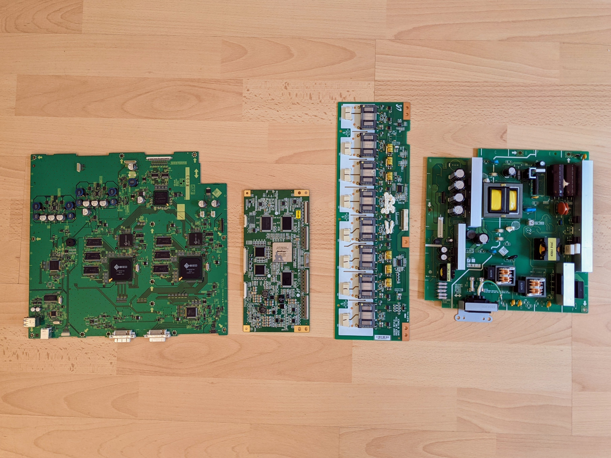
The one second from the right is just for supporting the backlighting tubes.

_An almost obscene amount of really substantial pieces of metal._  
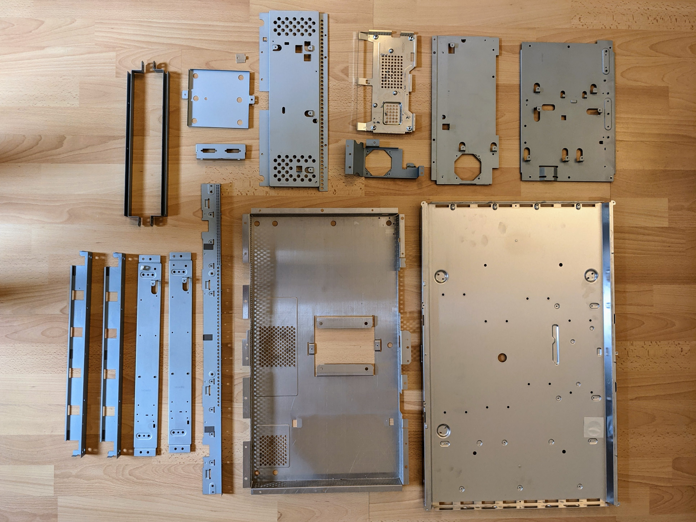

_More metal._  
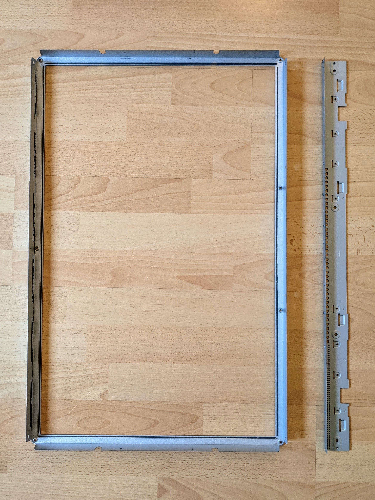

_The LCD panel (from Samsung) with various diffusers for the backlighting._  
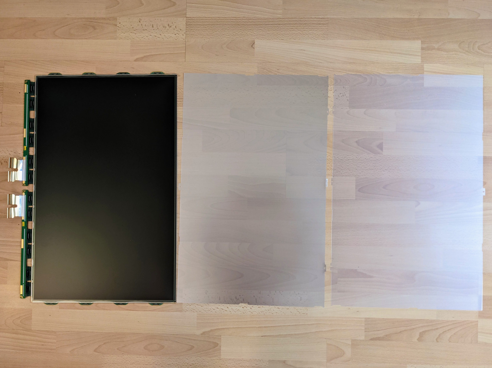

_Even more diffusers and the back-panel for the backlighting tubes and the tubes themselves._  
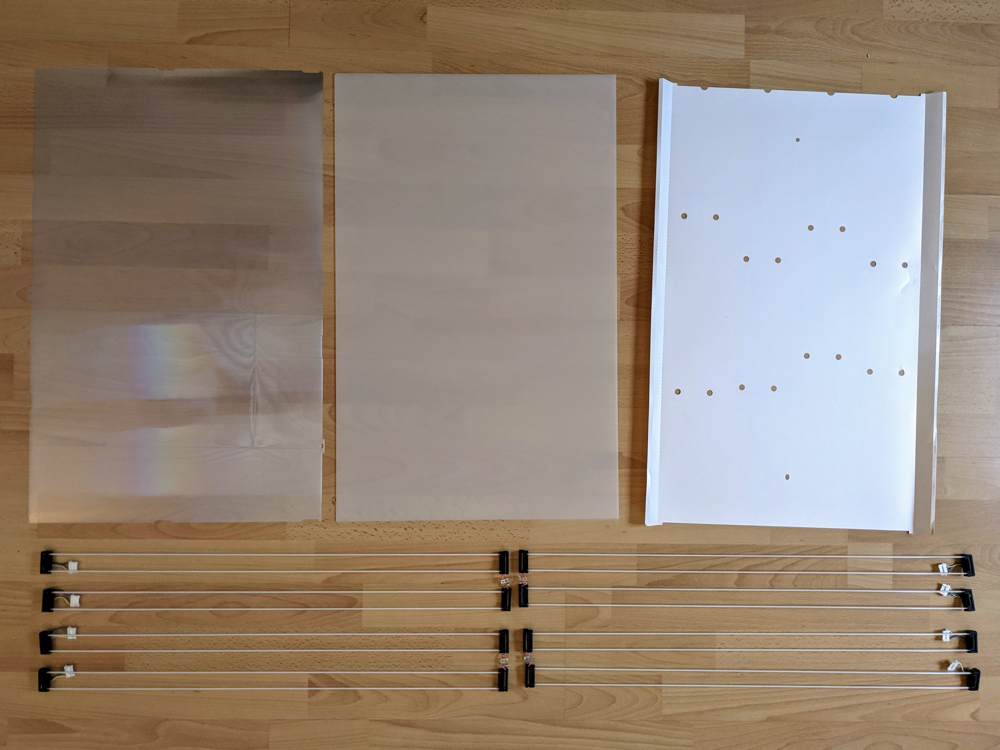

_A substantial plastic frame._  
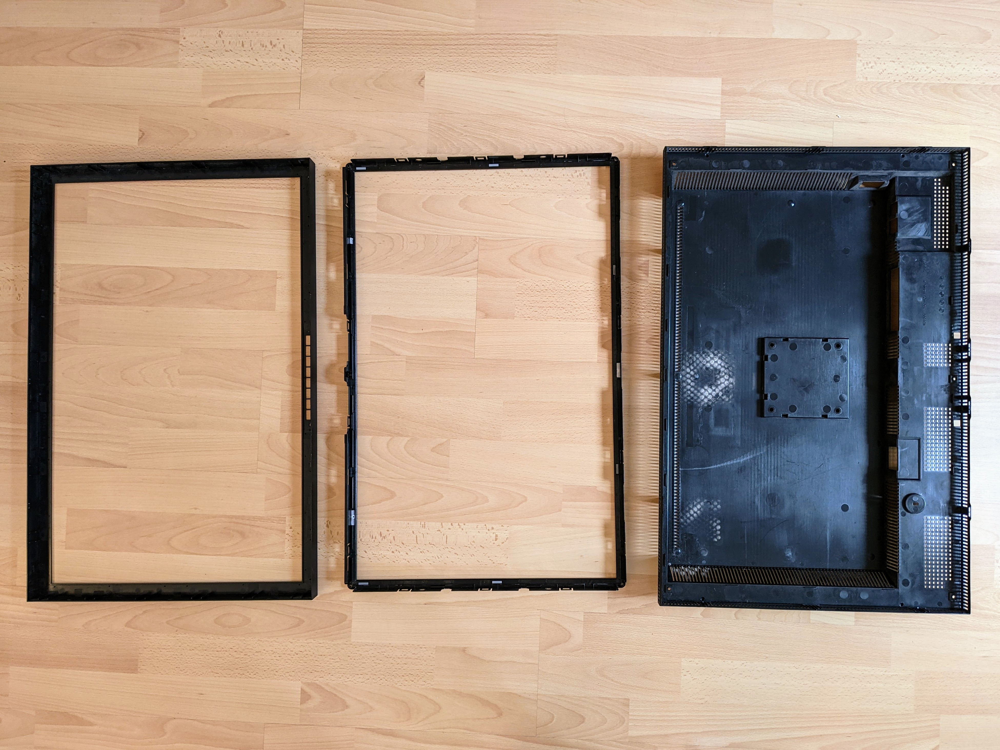

_Various plastic inserts and separators._  
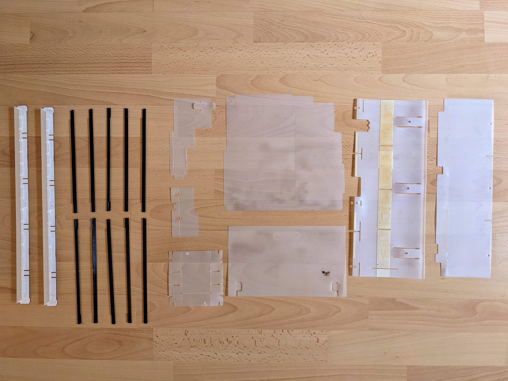

_Various connectors, fans, the buttons (for on/off etc.) and an amazing number of screws and bolts._  
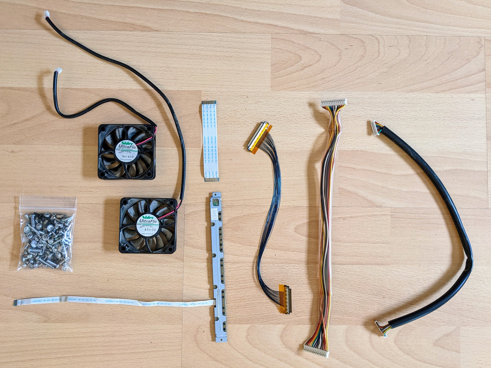

Stand
-----

The monitor is extremely heavy so the stand has to be correspondingly heavy to prevent it tipping over.

_More substantial pieces of metal._  
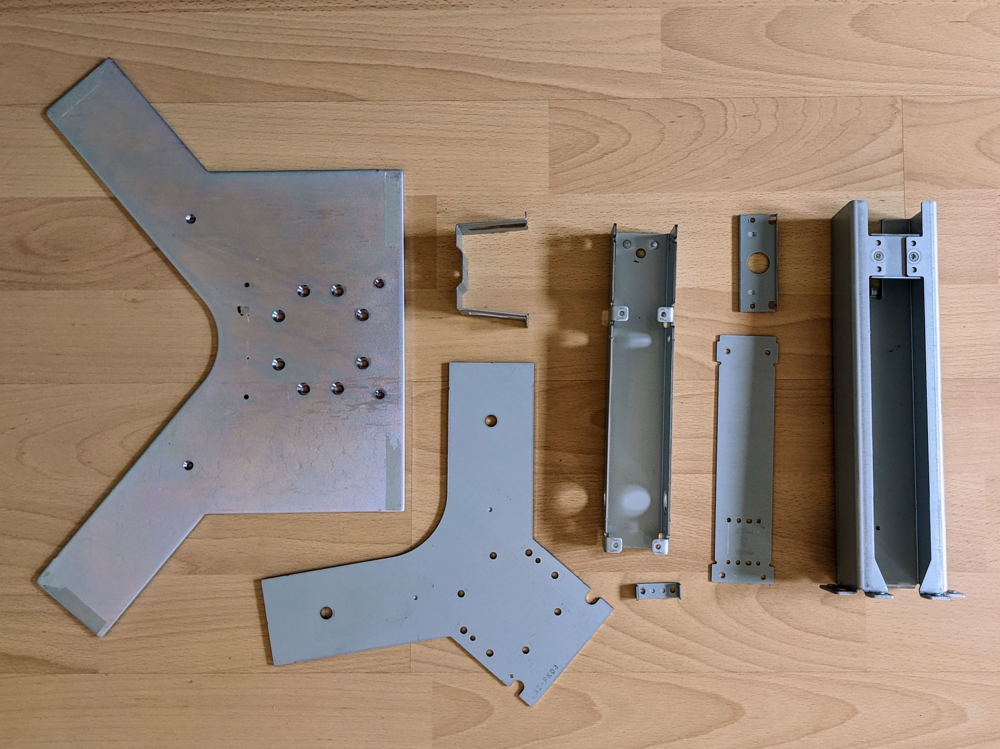
The left-most plate is amazingly heavy.

_Various pieces (some of which I didn't completely disassemble) and more screws and bolts._  
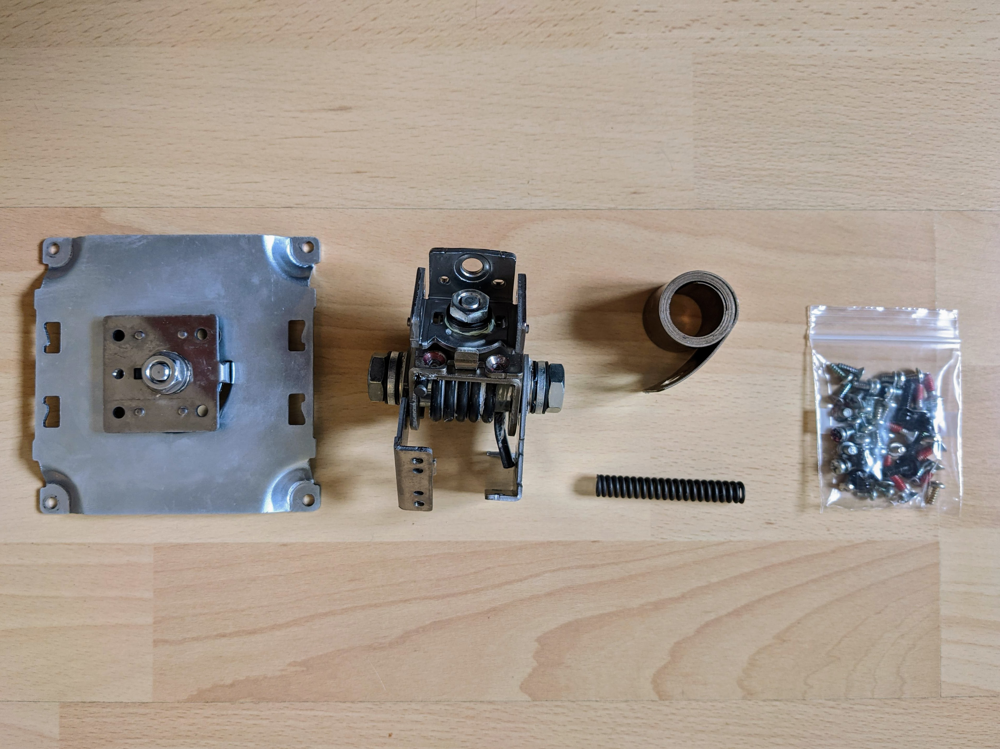

_The plastic components of the stand._  
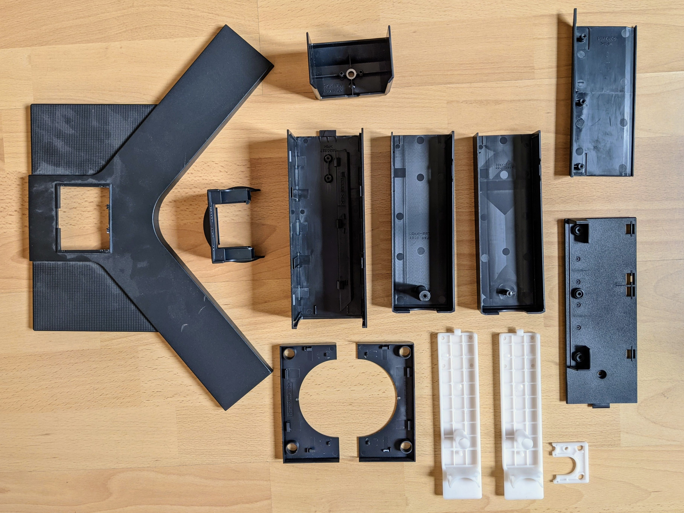
